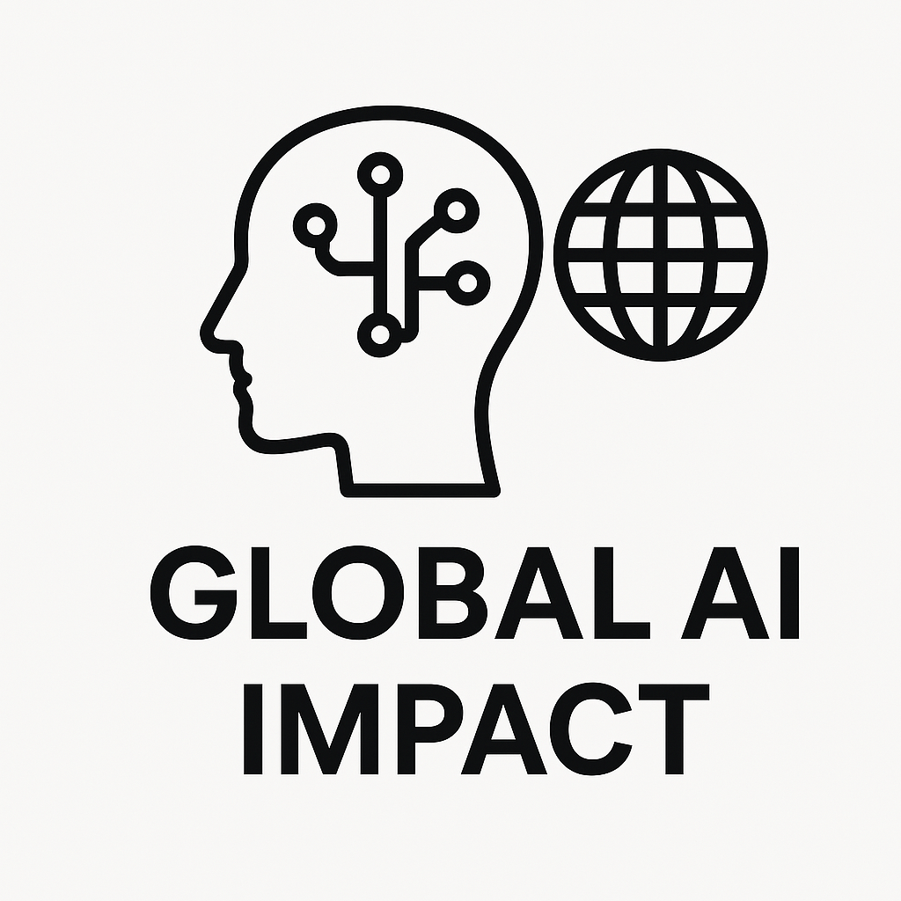

## _Practicing the DataScience skills with an educational dataset from kaggle_

# 🌍 Global AI Impact Analysis (2020–2025)

This project is my educational work which helps me to apply my knowledge in IT fields like: Data Visualization, Data Preprocessing, ML, GitHub. This work is based on the kaggle dataset [Global AI Impact for 6 years](https://www.kaggle.com/datasets/atharvasoundankar/impact-of-ai-on-digital-media-2020-2025/data?select=Global_AI_Content_Impact_Dataset.csv). 

## 🔍 The aim of this work

To elucidate how the AI development affected the Global life for the last 5 years and make possible explanation to such results.

## 🧰 My Instruments

- Python libraries:
  - Pandas, Numpy, Matplotlib, Seaborn, Scikit-learn
- Google Colab
- Git Bash

## 📂 Project structure

- `notebooks/`: code
- `data/`: data for analysis
- `README.md`: description

## 📊 Краткий обзор анализа

- 📈 AI in different industries
- 🌍 Top countries in AI adoption in 2025
- 🔮 Some ML models (LogisticRegression, XGboost...)

